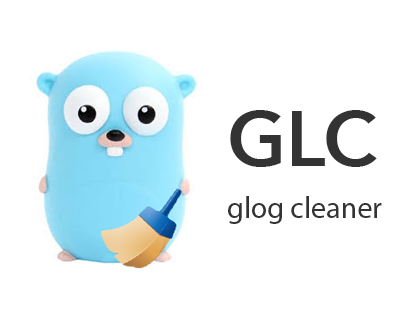

# GLC (glog cleaner)

[](https://travis-ci.com/xuri/glc)
[](https://codecov.io/gh/xuri/glc)
[](https://goreportcard.com/report/github.com/xuri/glc)
[](https://pkg.go.dev/github.com/xuri/glc)
[](https://github.com/xuri/glc/blob/master/LICENSE)
[](https://www.paypal.me/xuri)

## 简介

GLC (glog cleaner) 是 Go 语言编写的 glog 日志清理类库，[glog](https://github.com/golang/glog) 是由 Google 开发的一个应用级日志框架，提供了日志分级、文件切分等功能，但是暂未提供日志清理功能，配合 GLC 可以方便地实现日志清理功能，类库提供了自定义日志保留时间、日志文件名前缀匹配和清理扫描频率的支持。

## 安装

```go
go get github.com/xuri/glc
```

## 使用方式

下面是一个简单的例子，每小时清理日志，仅保留 30 分钟内指定目录下以 glc 做前缀由 glog 产生的日志：

```go
glc.NewGLC(glc.InitOption{
	Path:     path,
	Prefix:   `glc`,
	Interval: time.Duration(time.Hour),
	Reserve:  time.Duration(time.Minute * 30),
})
```

## 社区合作

欢迎您为此项目贡献代码，提出建议或问题、修复 Bug 以及参与讨论对新功能的想法。

## 开源许可

本项目遵循 MIT 开源许可协议，访问 [LICENSE](https://github.com/xuri/glc/blob/master/LICENSE) 查看许可协议文件。
